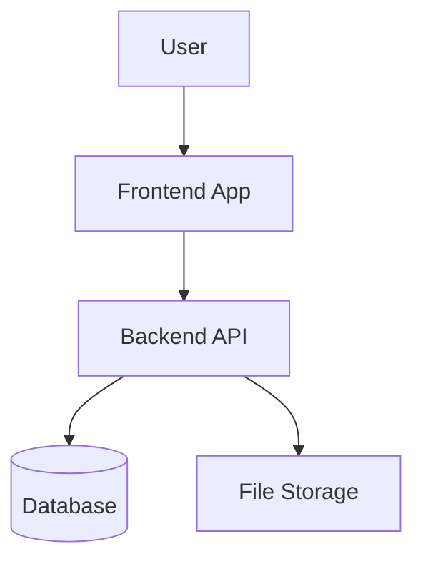

# Project Documentation Cleanup Skill

## Purpose

Use this skill when a software project is nearly finished, after a major development/refactor phase, or before handover, and the repository contains many temporary Markdown files, prompts, refactor plans, outdated notes, or duplicated documentation.

The goal is to clean up, reorganize, archive, and rewrite the project documentation so future developers, BA, QA, PM, Tech Lead, or AI agents can understand the project correctly.

This skill must prioritize the current source code over old Markdown documents.

---

## When To Use

Use this skill when the user asks to:

- Clean up project `.md` files
- Rewrite important project documentation
- Organize development notes and prompts
- Archive outdated planning documents
- Prepare documentation after project completion
- Make the repository easier for another AI or developer to understand
- Create a final documentation set for handover, maintenance, or production readiness

Typical user requests:

```txt
Dọn lại toàn bộ file MD của dự án
Làm sạch tài liệu sau khi dev xong
Viết lại docs quan trọng theo code hiện tại
Archive mấy file prompt, plan cũ
Chuẩn hóa README và docs cho dự án
```

---

## Core Principle

Source code is the source of truth.

Old Markdown files are only references. If old documentation conflicts with the current codebase, trust the current codebase.

Do not invent features that are not implemented.

If something is unclear, mark it as:

```txt
TODO: Verify with source owner
```

---

## Safety Rules

The AI agent must follow these rules strictly:

1. Do not delete any Markdown file permanently.
2. Do not modify business logic.
3. Do not change source code unless the user explicitly requests it.
4. Do not expose secrets from `.env`, config files, logs, or old documents.
5. If secrets are found in documentation, replace them with placeholders.
6. Do not claim a feature exists unless verified in the source code.
7. Do not make the project look more complete than it really is.
8. Archive old files instead of deleting them.
9. Create an audit report before reorganizing documents.
10. Preserve important historical decisions in archive folders.

---

## Documentation Role Mapping

Use this role model when rewriting or reviewing documents:

| Documentation Area | Main Owner | Review By |
|---|---|---|
| Project overview | PM / PO / BA | Tech Lead |
| Business workflow | BA | PM / Key User / Tech Lead |
| Permission model | BA + Tech Lead | Security / Business Owner |
| Document type configuration | BA | Tech Lead / Key User |
| E-signature flow | BA + Tech Lead | Legal / Security |
| System architecture | Solution Architect / Tech Lead | Senior Dev / DevOps |
| Database schema | Backend Dev / Tech Lead | DBA if available |
| API documentation | Backend Dev | Frontend Dev / QA |
| Frontend structure | Frontend Dev | Tech Lead |
| Backend structure | Backend Dev | Tech Lead |
| Deployment guide | DevOps / Tech Lead | Backend Dev |
| Security review | Security Engineer / Tech Lead | PM / DevOps |
| Testing guide | QA Lead / Tester | Dev Lead |
| Changelog | PM / Tech Lead | Dev Team |
| Roadmap | PM / PO | Business Owner / Tech Lead |

For small teams, use this simplified workflow:

```txt
AI drafts documentation
↓
Tech Lead verifies against source code
↓
BA verifies business workflow
↓
QA creates test checklist
↓
PM / Owner approves final version
```

---

## Required Workflow

### Step 1: Repository Scan

Scan the repository and identify:

- All Markdown files
- Existing documentation folders
- README files
- Prompt files
- Refactor plans
- Implementation notes
- Architecture documents
- API documents
- Business requirement documents
- Outdated or duplicated files

Also inspect relevant source code folders, such as:

```txt
src/
app/
pages/
components/
api/
server/
backend/
frontend/
database/
prisma/
migrations/
docs/
```

The exact folders depend on the project structure.

---

### Step 2: Classify Markdown Files

Classify every `.md` file into one of these groups:

| Group | Meaning | Action |
|---|---|---|
| CORE_DOCS | Important documentation that should remain active | Rewrite or update |
| DRAFT_DOCS | Temporary prompts, dev notes, AI-generated plans | Move to archive |
| OUTDATED_DOCS | Documents that no longer match current code | Move to archive/outdated |
| DUPLICATE_DOCS | Duplicated or overlapping documents | Merge and archive old copy |
| REFERENCE_DOCS | Still useful references but not core docs | Move to docs/reference |
| UNKNOWN_DOCS | Unclear purpose | Mark for human review |

---

### Step 3: Create Documentation Audit Report

Before modifying files, create:

```txt
docs/DOCUMENTATION_AUDIT_REPORT.md
```

The report must contain this table:

```md
# Documentation Audit Report

## Summary

| Category | Count |
|---|---:|
| Core docs |  |
| Draft docs |  |
| Outdated docs |  |
| Duplicate docs |  |
| Reference docs |  |
| Need human review |  |

## File Audit

| File | Current Purpose | Status | Action | Reason |
|---|---|---|---|---|
| README.md | Project introduction | CORE_DOCS | Rewrite | Needs update based on current code |
```

Do not skip this report.

---

### Step 4: Create Final Documentation Structure

Create or update this structure:

```txt
README.md
docs/
  DOCS_INDEX.md
  01_PROJECT_OVERVIEW.md
  02_SYSTEM_ARCHITECTURE.md
  03_BUSINESS_WORKFLOW.md
  04_PERMISSION_MODEL.md
  05_DOCUMENT_TYPE_CONFIG.md
  06_E_SIGNATURE_FLOW.md
  07_DATABASE_SCHEMA.md
  08_API_DOCUMENTATION.md
  09_FRONTEND_STRUCTURE.md
  10_BACKEND_STRUCTURE.md
  11_DEPLOYMENT_GUIDE.md
  12_SECURITY_REVIEW.md
  13_TESTING_GUIDE.md
  14_CHANGELOG.md
  15_ROADMAP.md
  reference/
  archive/
    old-plans/
    old-prompts/
    outdated/
    duplicates/
    unknown/
```

---

## Required Final Documents

### README.md

Must include:

- Project name
- Short description
- Main features
- Tech stack
- Setup guide
- How to run locally
- Important folders
- Link to `docs/DOCS_INDEX.md`
- Current project status
- Known limitations

Do not make README too long. It should be the entry point.

---

### docs/DOCS_INDEX.md

Must include:

```md
# Documentation Index

| Document | Purpose | Main Audience |
|---|---|---|
| 01_PROJECT_OVERVIEW.md | Business and product overview | PM, BA, Owner |
| 02_SYSTEM_ARCHITECTURE.md | Technical architecture | Tech Lead, Dev |
| 03_BUSINESS_WORKFLOW.md | Main business flows | BA, QA, Dev |
| 04_PERMISSION_MODEL.md | Roles and access control | BA, Security, Dev |
```

---

### docs/01_PROJECT_OVERVIEW.md

Must include:

- Project background
- Business problem
- Target users
- Main modules
- In-scope features
- Out-of-scope features
- Current completion status
- Key risks

---

### docs/02_SYSTEM_ARCHITECTURE.md

Must include:

- Architecture overview
- Frontend/backend/database relationship
- External integrations
- Authentication flow
- File storage flow
- Mermaid diagram if useful

Example:



---

### docs/03_BUSINESS_WORKFLOW.md

Must document:

- Main user journey
- Document creation flow
- Approval flow
- Signing flow
- Rejection / resubmission flow
- Status transition table
- Edge cases

Example table:

```md
| From Status | Action | To Status | Actor |
|---|---|---|---|
| Draft | Submit | Pending Approval | Creator |
| Pending Approval | Approve | Pending Signature | Approver |
| Pending Approval | Reject | Rejected | Approver |
```

---

### docs/04_PERMISSION_MODEL.md

Must document carefully:

- User roles
- Department-based access
- Document type access
- View permission
- Create permission
- Edit permission
- Approve permission
- Sign permission
- Admin permission
- Security risks

Example:

```md
| Role | View | Create | Edit | Approve | Sign | Admin |
|---|---|---|---|---|---|---|
| Employee | Own documents | Yes | Own draft | No | No | No |
| Manager | Department documents | Yes | Limited | Yes | Optional | No |
| Admin | All documents | Yes | Yes | Yes | Yes | Yes |
```

---

### docs/05_DOCUMENT_TYPE_CONFIG.md

Must document:

- Document type code
- Document type name
- Auto-numbering rule
- Approval requirement
- Default security level
- Default visibility scope
- E-signature allowed or not
- Who can create this document type
- Who can view documents of this type

Important for e-office systems.

---

### docs/06_E_SIGNATURE_FLOW.md

Must document:

- Signature preparation
- Signature field placement
- Coordinate system
- PDF rendering rule
- Signing actor
- Signature image / digital signature / USB token / HSM support if applicable
- Audit log
- Legal or security notes

For PDF field positioning, use a clear standard:

```txt
x, y = top-left position of field
width, height = field size
all values are stored as percentage of page width/height
frontend preview and backend PDF rendering must use the same coordinate system
```

---

### docs/07_DATABASE_SCHEMA.md

Must document:

- Main tables
- Important fields
- Relationships
- Indexes if visible
- Migration files if applicable
- Data ownership rule

Use tables:

```md
| Table | Purpose | Important Fields |
|---|---|---|
| users | Store user accounts | id, email, role, department_id |
| documents | Store document metadata | id, title, status, created_by |
```

---

### docs/08_API_DOCUMENTATION.md

Must document:

- API base path
- Authentication method
- Main endpoints
- Request/response examples
- Error format
- Permission requirements per endpoint

Example:

```md
| Method | Endpoint | Purpose | Permission |
|---|---|---|---|
| GET | /api/documents | List documents | Authenticated user |
| POST | /api/documents | Create document | Create permission |
```

---

### docs/09_FRONTEND_STRUCTURE.md

Must document:

- Frontend framework
- Important pages
- Important components
- State management
- Form handling
- Permission handling in UI
- Known UI limitations

---

### docs/10_BACKEND_STRUCTURE.md

Must document:

- Backend framework
- Main modules
- Services
- Controllers/routes
- Middleware
- Auth logic
- Permission checking logic
- File handling logic

---

### docs/11_DEPLOYMENT_GUIDE.md

Must document:

- Environment variables
- Build command
- Run command
- Database migration command
- Deployment steps
- Docker usage if applicable
- Common deployment errors

Never expose real secrets.

Use placeholders:

```env
DATABASE_URL=***
JWT_SECRET=***
STORAGE_ACCESS_KEY=***
```

---

### docs/12_SECURITY_REVIEW.md

Must document:

- Authentication risks
- Authorization risks
- File access risks
- Document visibility risks
- Signature risks
- Audit log risks
- Environment secret risks
- Recommended fixes

Use severity:

```md
| Risk | Severity | Current Status | Recommendation |
|---|---|---|---|
| Missing server-side permission check | High | Need verification | Add middleware validation |
```

---

### docs/13_TESTING_GUIDE.md

Must document:

- Manual test checklist
- Role-based test cases
- Permission test cases
- Document workflow test cases
- E-signature test cases
- Regression test areas

Example:

```md
## Permission Test Checklist

- [ ] Employee cannot view confidential documents from another department
- [ ] Manager can approve only allowed document types
- [ ] Admin can configure document types
- [ ] Rejected document can be edited only by creator
```

---

### docs/14_CHANGELOG.md

Must include:

- Major changes
- Documentation cleanup date
- Important refactors
- Breaking changes
- Known pending items

---

### docs/15_ROADMAP.md

Must include:

- Short-term improvements
- Security improvements
- Workflow improvements
- Technical debt
- Future integration ideas

Do not add unrealistic features.

---

## Writing Style

Use clear, professional, practical documentation.

Prefer:

- Short paragraphs
- Tables
- Mermaid diagrams
- Checklists
- Explicit assumptions
- Clear TODO markers

Avoid:

- Marketing language
- Overclaiming
- Fake completion status
- Long vague explanations
- Unverified technical claims

---

## Special Rules For E-Office / Document Signing Projects

If the project is an internal document management, approval, or signing system, pay extra attention to:

1. Document type configuration
2. Auto-numbering rules
3. Default visibility scope
4. Department-based access
5. Role-based access control
6. Approval workflow
7. Signing workflow
8. PDF signature coordinate system
9. Audit logs
10. Legal and security review notes

Do not treat signature image, electronic signature, digital signature, USB token signing, and HSM signing as the same thing. Document the actual implemented level clearly.

---

## Final Response Format

After completing the work, provide this summary:

```md
## Documentation Cleanup Summary

### Files Created
- ...

### Files Updated
- ...

### Files Moved To Archive
- ...

### Files Needing Human Review
- ...

### Remaining Documentation Risks
- ...

### Recommended Next Step
- ...
```

---

## Minimal Prompt To Trigger This Skill

```md
Use the project-documentation-cleanup skill.
Scan this repository, classify all Markdown files, create docs/DOCUMENTATION_AUDIT_REPORT.md, archive non-core docs, and rewrite the final documentation set based on the current codebase. Do not delete files. Do not invent features. Mark unclear items as TODO.
```
